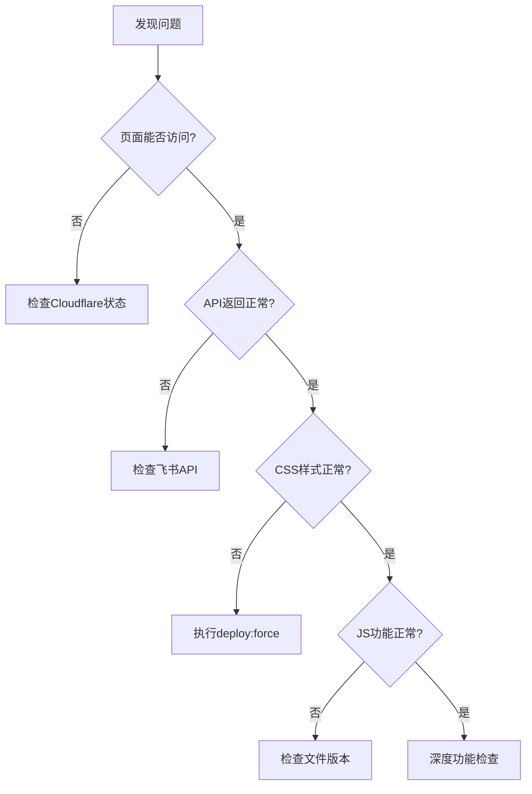

# AI创投日报运维操作手册

## 📋 目录
- [1. 问题预防](#1-问题预防)
- [2. 监控体系](#2-监控体系)
- [3. 故障处理](#3-故障处理)
- [4. 应急响应](#4-应急响应)
- [5. 日常维护](#5-日常维护)

---

## 1. 问题预防

### 🛡️ 预防性措施

#### 数据同步安全流程
```bash
# 标准同步流程
npm run safe:sync           # 验证 → 同步 → 再验证
npm run health:check        # 综合健康检查
```

#### 部署完整性验证
```bash
# 部署前验证
npm run verify:deployment   # 检查版本一致性

# 安全部署流程
npm run safe:deploy         # 备份 → 部署 → 验证
```

### 🔍 关键检查点

| 检查项目 | 命令 | 健康标准 |
|---------|------|----------|
| 页面加载 | `curl https://svtr.ai` | 200状态码，包含"AI创投日报" |
| API接口 | `curl https://svtr.ai/api/wiki-funding-sync` | success=true，count>0 |
| 3D翻转功能 | 检查CSS文件 | 包含"rotateY(180deg)" |
| 团队背景 | 检查API数据 | teamBackground字段存在 |
| 创始人链接 | 检查JS文件 | 包含"addLinksToTeamBackground" |

---

## 2. 监控体系

### 📊 自动化监控

#### GitHub Actions监控
- **日常健康检查**: 每天9点、18点自动执行
- **同步后验证**: 数据同步完成后自动触发
- **部署完整性**: 每次部署后自动验证

#### 本地监控脚本
```bash
# 实时功能监控
npm run monitor:funding     # 全面功能状态检查

# 部署完整性验证
npm run verify:deployment   # 文件版本一致性检查
```

### 🚨 告警机制

#### 严重程度分级
- **🔴 Critical**: 页面无法访问或核心功能全部失效
- **🟠 Degraded**: 部分功能失效（如3D翻转、团队背景等）
- **🟡 Warning**: 性能下降或非关键功能异常
- **🟢 Healthy**: 所有功能正常

#### 自动修复触发条件
1. 部署完整性验证失败
2. 关键功能监控异常
3. API数据接口返回错误
4. CSS/JS文件版本不匹配

---

## 3. 故障处理

### 🚨 常见故障类型

#### A. 设计回归问题
**症状**: 3D卡片翻转失效，页面样式回到初始状态
**原因**: 生产环境CSS/JS文件版本落后

**解决方案**:
```bash
# 方案1: 强制重新部署
npm run deploy:force

# 方案2: 安全部署流程
npm run safe:deploy

# 方案3: 紧急修复
npm run emergency:restore
```

#### B. API数据异常
**症状**: 融资卡片显示但缺少团队背景、超链接等
**原因**: 飞书API数据字段缺失或格式错误

**解决方案**:
```bash
# 检查数据质量
npm run scan:data-quality

# 强制完整同步
npm run sync:complete

# 修复数据缺失
npm run fix:data-gaps
```

#### C. 功能部分失效
**症状**: 某些功能正常，某些功能异常
**原因**: 前端代码部分更新，存在版本混合

**解决方案**:
```bash
# 验证文件完整性
npm run verify:deployment

# 清理缓存后重新部署
npm run deploy:force

# 等待生效后验证
sleep 60 && npm run health:check
```

### 🔧 故障诊断流程



---

## 4. 应急响应

### 🆘 紧急修复流程

#### 1. 立即评估
```bash
# 快速健康检查
npm run health:check

# 检查关键指标
curl -I https://svtr.ai
curl -s https://svtr.ai/api/wiki-funding-sync | jq '.success'
```

#### 2. 应急恢复
```bash
# 紧急恢复命令（组合操作）
npm run emergency:restore

# 等效手动命令
npm run rollback
npm run deploy:force
npm run verify:deployment
```

#### 3. 验证修复
```bash
# 等待生效
sleep 60

# 全面验证
npm run health:check
npm run monitor:funding
```

### 📞 联系方式

#### 紧急联系
- **技术负责人**: [预留联系方式]
- **运维团队**: [预留联系方式]
- **Cloudflare支持**: [账户信息]

#### 备用方案
- **备用域名**: https://c1e7b62c.chatsvtr.pages.dev
- **状态页面**: [内部状态监控页面]

---

## 5. 日常维护

### 📅 维护计划

#### 每日检查 (自动化)
- [x] 09:00 - 功能健康检查
- [x] 18:00 - 功能健康检查
- [x] 数据同步后 - 自动验证

#### 每周检查 (手动)
- [ ] 周一: 综合性能分析
- [ ] 周三: 数据质量评估
- [ ] 周五: 部署完整性深度检查

#### 每月检查
- [ ] 监控数据分析和趋势评估
- [ ] 预防性措施效果评估
- [ ] 应急流程演练

### 🔧 预防性维护

#### 代码质量
```bash
# 代码检查
npm run lint
npm run test

# 性能优化
npm run optimize:all
```

#### 数据清理
```bash
# 清理过期监控数据
find .monitor -name "*.json" -mtime +30 -delete

# 清理备份文件
npm run cleanup:backups
```

### 📊 性能监控

#### 关键指标
- **页面加载时间**: < 3秒
- **API响应时间**: < 2秒
- **资源加载时间**: < 1秒
- **功能完整性**: 100%

#### 监控命令
```bash
# 性能基准测试
npm run benchmark

# 功能覆盖率检查
npm run coverage:check
```

---

## 📚 相关文档

- [部署完整性验证脚本](../scripts/verify-deployment-integrity.js)
- [功能监控脚本](../scripts/monitor-funding-daily.js)
- [智能同步策略](../scripts/smart-sync-strategy.js)
- [GitHub Actions工作流](.github/workflows/funding-daily-health-check.yml)

---

## 🚀 快速参考

### 最常用命令
```bash
# 健康检查
npm run health:check

# 安全同步
npm run safe:sync

# 安全部署
npm run safe:deploy

# 紧急修复
npm run emergency:restore

# 验证部署
npm run verify:deployment
```

### 故障速查
| 问题 | 快速解决 |
|------|----------|
| 3D翻转失效 | `npm run deploy:force` |
| 团队背景缺失 | `npm run sync:complete` |
| 页面样式错乱 | `npm run emergency:restore` |
| API数据异常 | `npm run safe:sync` |
| 全面功能检查 | `npm run health:check` |

---

*最后更新: 2025-01-21*
*文档版本: v1.0*