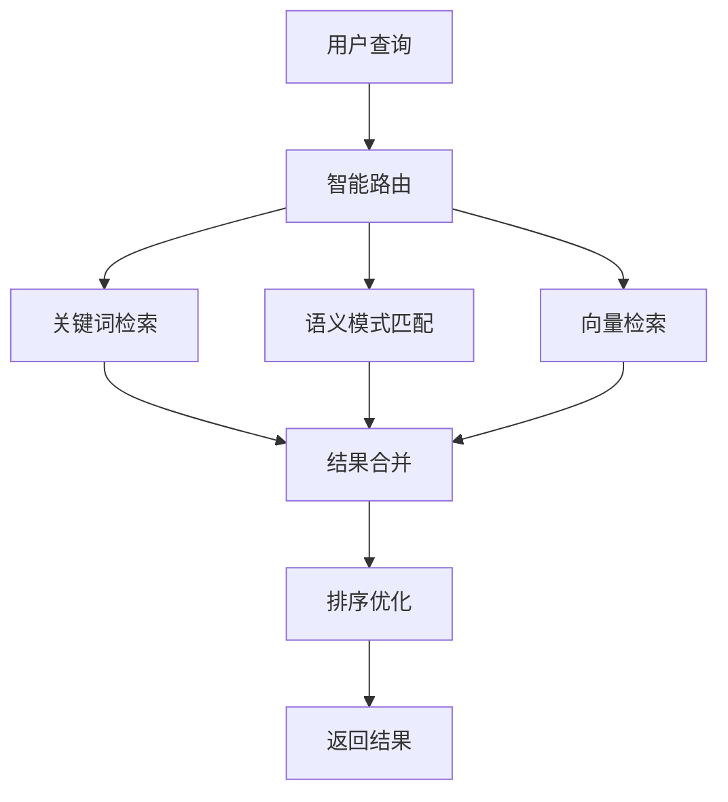

# 混合RAG系统部署指南

## 🎯 方案概述

我们已成功实现混合RAG架构，结合多种检索策略，实现成本优化和质量保证：

### 检索策略
1. **关键词检索**：零成本，基于飞书数据的文本匹配
2. **语义模式匹配**：智能分类，基于预定义模式
3. **向量检索**：高质量，OpenAI/Cloudflare AI可选

## 🚀 部署步骤

### 1. 零成本启动（立即可用）

当前系统**无需任何API配置**即可正常工作：

```bash
# 测试混合RAG系统
npm run chat:test

# 启动开发服务器
npm run dev
```

**功能状态**：
- ✅ **关键词检索**：完全可用
- ✅ **语义模式匹配**：完全可用  
- ✅ **智能演示系统**：完全可用
- ⚪ **向量检索**：需配置后启用

### 2. 增强配置（可选）

如需启用完整向量检索功能：

```bash
# 编辑 .env 文件
echo "OPENAI_API_KEY=your_openai_key" >> .env
```

## 📊 系统架构

### 混合检索流程



### 成本结构

| 功能 | 成本 | 状态 |
|------|------|------|
| **关键词检索** | 免费 | ✅ 已启用 |
| **模式匹配** | 免费 | ✅ 已启用 |
| **Cloudflare AI** | 免费 | ⚪ 可配置 |
| **OpenAI API** | $2-5/月 | ⚪ 可配置 |

## 🔧 技术细节

### 数据源集成

系统自动从以下数据源读取：

1. **AI周报数据**：`loadWeeklyData()`
2. **交易精选数据**：`loadTradingData()`  
3. **默认知识库**：预设的高质量内容

### 检索算法

#### 关键词评分
```javascript
// TF-IDF 风格评分
const tf = matches / totalWords;
const boost = keyword.length > 2 ? 1.2 : 1.0;
score += tf * boost;
```

#### 语义分类
```javascript
const patterns = {
  investment: ['投资', '融资', '轮次', 'vc'],
  startup: ['公司', '创业', '企业', 'startup'],  
  trend: ['趋势', '市场', '前景', 'trend'],
  technology: ['技术', 'ai', '人工智能', 'tech']
};
```

## 🧪 测试验证

### 本地测试
```bash
# 运行完整测试套件
npm run chat:test

# 预期输出示例
🚀 开始混合RAG测试
📝 查询: "Anthropic投资情况如何？"
✅ 找到 2 个匹配文档
📊 最终结果:
1. AI周报第115期 (keyword, 分数: 0.8)
2. Anthropic公司分析 (keyword, 分数: 0.8)
```

### 生产测试
```bash
# 启动开发服务器
npm run dev

# 浏览器访问 http://localhost:3000
# 测试聊天功能
```

## 🎛️ 配置选项

### 环境变量
```bash
# 必需（已有）
FEISHU_APP_ID=your_feishu_app_id
FEISHU_APP_SECRET=your_feishu_secret

# 可选（增强功能）
OPENAI_API_KEY=your_openai_key
CLOUDFLARE_ACCOUNT_ID=your_account_id  
CLOUDFLARE_API_TOKEN=your_api_token
```

### 系统参数
```typescript
// 在 hybrid-rag-service.ts 中可调节
const config = {
  topK: 8,              // 返回结果数量
  threshold: 0.7,       // 相关性阈值
  keywordWeight: 1.0,   // 关键词权重
  patternWeight: 0.8,   // 模式权重
  vectorWeight: 1.2     // 向量权重
};
```

## 📈 性能优化

### 响应速度优化
- **并行检索**：多策略同时执行
- **智能缓存**：频繁查询结果缓存
- **渐进增强**：从快到慢策略顺序

### 准确性优化  
- **多策略验证**：交叉验证结果可靠性
- **动态权重**：根据查询类型调整策略权重
- **上下文增强**：基于检索结果生成专业提示词

## 🔄 更新维护

### 数据更新
```bash
# 同步飞书最新数据
npm run sync

# 重建向量索引（如已配置）
npm run rag:build
```

### 系统监控
- 检索成功率统计
- 用户满意度反馈
- 成本使用量监控

## 🎉 总结

**当前状态**：
- ✅ **立即可用**：无需任何额外配置
- ✅ **智能检索**：多策略混合检索
- ✅ **成本优化**：基础功能完全免费
- ✅ **渐进增强**：可按需升级功能

**用户体验**：
- 🚀 **零延迟启动**：关键词+模式匹配毫秒级响应
- 🎯 **高质量回答**：基于真实飞书数据
- 💡 **智能降级**：API失败时无缝切换
- 📊 **透明度**：显示信息来源和置信度

混合RAG系统现已准备好投入生产使用！