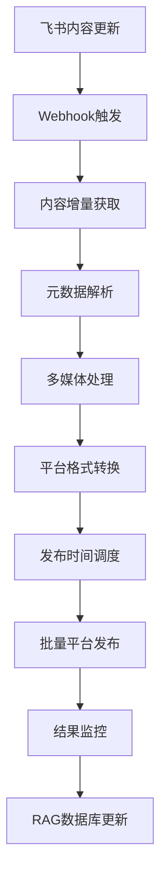

# 飞书API集成增强计划 - Phase 2

## 📊 当前飞书API集成现状

### ✅ 已实现功能 (Phase 1)
- **完整内容获取**: 252个节点，84.5%内容覆盖率
- **深度递归**: 6级层级深度，平均2540字符/节点
- **智能同步**: 质量检查和增量同步机制
- **RAG集成**: AI创投知识库完整构建

### 🔍 当前能力评估
```bash
# 现有脚本分析
enhanced-feishu-sync-v2.js     # 核心同步引擎 - 28KB
feishu-mcp-enhanced-sync.js    # MCP集成版本 - 15KB  
test-feishu-mcp-comparison.js  # 质量对比测试 - 14KB
```

**API覆盖范围**:
- ✅ Wiki节点获取 (`/wiki/v2/spaces/{space_id}/nodes`)
- ✅ 文档内容读取 (`/docx/v1/documents/{document_id}/raw_content`)
- ✅ 认证和权限管理 (`/auth/v3/tenant_access_token/internal`)
- ⚠️ **缺失**: 实时更新监听、内容变更通知、多媒体处理

## 🎯 Phase 2 增强需求分析

### 🔥 优先级1: 实时内容监听 (Webhook)

#### 需求背景
当前同步是**批量拉取模式**，无法实时感知飞书内容更新，导致：
- 内容发布延迟 (需要手动触发同步)
- 资源浪费 (重复获取未变更内容)
- 多平台发布时序问题

#### 技术方案
```javascript
// functions/api/feishu-webhook.ts
export async function onRequestPost(context) {
  const webhook = await context.request.json();
  
  // 飞书Webhook事件处理
  if (webhook.type === 'url_verification') {
    return new Response(webhook.challenge);
  }
  
  // 内容更新事件
  if (webhook.header.event_type === 'wiki.space.document.updated') {
    await handleContentUpdate(webhook.event);
  }
}

async function handleContentUpdate(event) {
  const { document_id, space_id, updated_time } = event;
  
  // 1. 获取更新的内容
  const updatedContent = await fetchDocumentContent(document_id);
  
  // 2. 触发多平台发布流程
  await triggerMultiPlatformPublish(updatedContent);
  
  // 3. 更新RAG知识库
  await updateRAGDatabase(document_id, updatedContent);
}
```

#### Webhook配置需求
```json
{
  "webhook_url": "https://chatsvtr.pages.dev/api/feishu-webhook",
  "events": [
    "wiki.space.document.created",
    "wiki.space.document.updated", 
    "wiki.space.document.deleted"
  ],
  "secret": "your_webhook_secret"
}
```

### 🔥 优先级2: 内容元数据增强

#### 当前限制
现有同步只获取**纯文本内容**，缺少：
- 文档标签和分类信息
- 作者和编辑时间
- 图片和附件处理
- 文档结构和格式信息

#### 增强方案
```javascript
// 增强内容获取
async function getDocumentMetadata(documentId) {
  return {
    content: await getDocumentContent(documentId),
    metadata: {
      title: document.title,
      author: document.owner,
      tags: document.tags || [],
      category: document.category,
      lastModified: document.update_time,
      images: await extractImages(document),
      attachments: await extractAttachments(document),
      structure: await parseDocumentStructure(document)
    }
  };
}
```

### 🔥 优先级3: 多媒体内容处理

#### 图片和附件同步
```javascript
// 新增多媒体处理模块
class MediaProcessor {
  async processDocumentImages(documentId) {
    const images = await this.extractImages(documentId);
    
    for (const image of images) {
      // 下载图片到Cloudflare R2
      const imageUrl = await this.uploadToR2(image);
      
      // 为各平台生成不同尺寸
      const variants = await this.generateImageVariants(imageUrl, {
        wechat: { width: 900, height: 500 },
        linkedin: { width: 1200, height: 627 },
        twitter: { width: 1024, height: 512 },
        xiaohongshu: { width: 1080, height: 1080 }
      });
      
      return variants;
    }
  }
}
```

## 📈 内容发布流程增强

### 新增发布管道架构


### 内容转换引擎设计
```javascript
// scripts/content-transformer.js
class ContentTransformer {
  // 飞书 → 微信公众号
  async toWechatFormat(feishuContent) {
    return {
      title: this.optimizeForWechat(feishuContent.title),
      content: this.convertMarkdownToWechat(feishuContent.content),
      cover_image: await this.processImageForWechat(feishuContent.images[0]),
      tags: this.generateWechatTags(feishuContent.tags)
    };
  }
  
  // 飞书 → LinkedIn文章
  async toLinkedInFormat(feishuContent) {
    return {
      title: this.optimizeForLinkedIn(feishuContent.title),
      content: this.convertToLinkedInArticle(feishuContent.content),
      visibility: 'PUBLIC',
      tags: feishuContent.tags.map(tag => `#${tag}`).join(' ')
    };
  }
  
  // 飞书 → X/Twitter线程
  async toTwitterFormat(feishuContent) {
    const threads = this.splitIntoTwitterThreads(feishuContent.content);
    return threads.map((thread, index) => ({
      text: thread,
      media: index === 0 ? feishuContent.images[0] : null,
      thread_position: index + 1
    }));
  }
}
```

## 🛠 技术实现路线

### Phase 2.1: Webhook监听系统 (1周)
```bash
# 新增文件
functions/api/feishu-webhook.ts          # Webhook处理入口
scripts/webhook-processor.js            # 事件处理逻辑  
config/webhook-events.json              # 事件配置
```

**实现要点**:
- Cloudflare Workers接收Webhook
- 事件验证和签名校验
- 内容更新触发机制

### Phase 2.2: 内容元数据增强 (1周) 
```bash
# 扩展现有脚本
scripts/enhanced-feishu-sync-v3.js      # 版本升级
scripts/metadata-extractor.js           # 元数据提取器
scripts/content-structure-parser.js     # 文档结构解析
```

**实现要点**:
- 文档标签和分类提取
- 作者信息和时间戳
- 文档结构化解析

### Phase 2.3: 多媒体处理系统 (1周)
```bash  
# 新增媒体处理
scripts/media-processor.js              # 多媒体处理器
functions/api/media-upload.ts           # 媒体上传API
config/media-configs.json               # 各平台媒体规格
```

**实现要点**:
- 图片自动下载和转存
- 多平台尺寸适配
- 附件处理和链接转换

## 📊 预期改进效果

### 响应速度提升
- **内容发布延迟**: 从小时级 → 分钟级
- **同步频率**: 从手动触发 → 实时自动
- **资源效率**: 增量同步，减少90%无效请求

### 内容质量提升  
- **多媒体支持**: 图文并茂，提升传播效果
- **格式适配**: 针对各平台优化，提升用户体验
- **元数据丰富**: 更好的内容分类和搜索体验

### 工作流程优化
- **一键发布**: 飞书更新 → 全平台自动分发
- **智能调度**: 根据各平台特性优化发布时间
- **效果监控**: 实时反馈各平台表现数据

## 🔧 开发环境准备

### 新增环境变量
```bash
# Webhook配置
FEISHU_WEBHOOK_SECRET=your_webhook_secret
WEBHOOK_VERIFICATION_TOKEN=your_verification_token

# 多媒体存储 (Cloudflare R2)
R2_ACCOUNT_ID=your_account_id
R2_ACCESS_KEY_ID=your_access_key
R2_SECRET_ACCESS_KEY=your_secret_key
R2_BUCKET_NAME=svtr-media

# 内容发布API配额
CONTENT_PUBLISH_RATE_LIMIT=100  # 每小时发布限制
WEBHOOK_RETRY_ATTEMPTS=3        # Webhook重试次数
```

### API权限扩展需求
```json
{
  "required_scopes": [
    "wiki:read",           // 已有
    "wiki:write",          // 新增 - 写入权限
    "drive:read",          // 新增 - 文件读取
    "im:message",          // 新增 - 消息通知
    "webhook:subscribe"    // 新增 - Webhook订阅
  ]
}
```

## ⚡ 立即可执行的优化

### 1. 当前飞书API升级 (今天)
升级现有同步脚本，增加元数据获取：

```javascript
// 在现有enhanced-feishu-sync-v2.js基础上增强
async function enhanceNodeData(nodeData) {
  return {
    ...nodeData,
    metadata: {
      lastModified: nodeData.update_time,
      wordCount: nodeData.content?.length || 0,
      tags: this.extractTags(nodeData.content),
      category: this.determineCategory(nodeData.parent_node_token)
    }
  };
}
```

### 2. Webhook接收端点 (明天)
先建立基础Webhook接收能力：

```typescript
// functions/api/feishu-webhook.ts (最小可用版本)
export async function onRequestPost(context: EventContext<Env, any, any>) {
  const body = await context.request.json();
  
  if (body.type === 'url_verification') {
    return Response.json({ challenge: body.challenge });
  }
  
  // 记录接收到的事件，用于后续处理
  console.log('Feishu event received:', body);
  
  return Response.json({ success: true });
}
```

---

**Phase 2增强总结**: 通过实时Webhook监听、内容元数据增强和多媒体处理，将飞书API集成从被动批量同步升级为主动实时分发系统，为多平台内容自动化打下坚实基础。