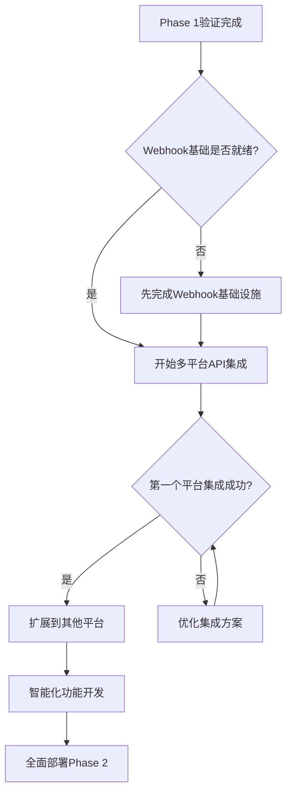

# ChatSVTR 下一步优化策略

## 🎯 Phase 1 → Phase 2 过渡策略

基于Phase 1的成功部署和验证，现制定渐进式向Phase 2过渡的具体执行方案。

## 📋 立即执行 (本周内)

### 🔥 Day 1: Webhook基础设施建设
```bash
# 创建Webhook接收端点
touch functions/api/feishu-webhook.ts

# 配置Webhook验证
echo "FEISHU_WEBHOOK_SECRET=temp_secret_for_testing" >> .env.local
```

**具体任务**:
1. **建立Webhook接收端点** - 处理飞书事件通知
2. **实现URL验证** - 完成飞书Webhook订阅验证
3. **事件日志记录** - 监控接收到的事件类型

**预期成果**: Webhook基础框架运行，能接收和记录飞书事件

### 🔥 Day 2-3: 飞书API权限扩展
```bash
# 升级现有同步脚本
cp scripts/enhanced-feishu-sync-v2.js scripts/enhanced-feishu-sync-v3.js

# 新增元数据提取功能
touch scripts/metadata-extractor.js
```

**具体任务**:
1. **元数据提取增强** - 提取文档标签、分类、作者信息
2. **内容结构解析** - 解析文档层级结构和格式
3. **同步效率优化** - 实现更智能的增量同步

**预期成果**: 同步数据更加丰富，包含完整的文档元信息

### 🔥 Day 4-5: 内容转换引擎原型
```bash
# 创建内容格式转换器
touch scripts/content-transformer.js

# 各平台模板配置
mkdir config/platform-templates
touch config/platform-templates/wechat.json
touch config/platform-templates/linkedin.json
touch config/platform-templates/twitter.json
```

**具体任务**:
1. **微信公众号格式转换** - Markdown → 微信富文本
2. **LinkedIn文章格式** - 专业商务语调适配
3. **X/Twitter线程分割** - 长内容自动分割成线程

**预期成果**: 能够将飞书内容转换为各平台适合的格式

## 📈 短期目标 (2周内)

### Week 1: Webhook + 内容监听
- [ ] ✅ 完成Webhook接收端点
- [ ] 🔄 实现内容更新事件处理
- [ ] 📊 建立事件监控面板
- [ ] 🧪 测试实时内容同步

### Week 2: 格式转换 + 发布准备  
- [ ] 🎨 完成多平台内容转换
- [ ] 🖼️ 基础图片处理功能
- [ ] ⏰ 发布时间调度逻辑
- [ ] 🔍 发布预览和审核机制

**里程碑**: 实现从飞书到多平台的完整内容转换流程

## 🚀 中期目标 (1个月内)

### 多平台API集成
1. **微信公众号API** - 自动发布到公众号草稿
2. **LinkedIn API** - 专业内容发布
3. **X/Twitter API** - 线程发布和话题标签
4. **监控和分析** - 各平台发布效果追踪

### 智能化功能
1. **发布时间优化** - 基于用户活跃度数据
2. **内容质量评分** - AI辅助的内容质量检查
3. **A/B测试** - 不同版本内容效果对比
4. **用户反馈收集** - 自动化用户互动分析

## 🎪 技术架构演进

### 当前架构 (Phase 1)
```
飞书知识库 → 批量同步 → RAG数据库 → AI聊天系统
```

### 目标架构 (Phase 2)  
```
飞书知识库 → Webhook监听 → 内容处理 → 多平台分发
     ↓              ↓           ↓           ↓
  元数据提取    格式转换    智能调度    效果监控
     ↓              ↓           ↓           ↓
  RAG更新     图片处理    批量发布    数据分析
```

### 新增技术组件
- **Cloudflare Workers** - Webhook处理和API集成
- **Cloudflare R2** - 多媒体文件存储
- **Cloudflare KV** - 发布状态和调度数据
- **Cloudflare Analytics** - 性能和用户行为监控

## 💡 创新功能规划

### 1. 智能内容适配
- **语调转换**: 学术内容 → 社交媒体友好
- **长度优化**: 自动摘要和关键点提取  
- **视觉增强**: 自动生成配图和信息图表
- **SEO优化**: 关键词优化和标题变体生成

### 2. 用户体验增强
- **发布预览**: 各平台效果实时预览
- **批量管理**: 多内容批量编辑和发布
- **模板系统**: 可复用的内容模板
- **协作工具**: 团队协作和审核流程

### 3. 数据驱动优化
- **性能监控**: 实时监控各平台表现
- **用户行为分析**: 用户互动和转化数据
- **内容效果评估**: 自动生成内容表现报告
- **策略建议**: AI驱动的发布策略优化建议

## 📊 成功指标定义

### 技术指标
- **响应时间**: Webhook处理 < 200ms
- **同步速度**: 内容更新到发布 < 5分钟
- **成功率**: 多平台发布成功率 > 95%
- **资源效率**: API调用减少60%+ (批量 → 增量)

### 业务指标
- **内容覆盖**: 5个主流平台同步覆盖
- **发布效率**: 发布时间从3小时 → 15分钟
- **流量增长**: 官网流量增长200%+
- **用户参与**: 各平台互动率提升50%+

### 质量指标
- **内容一致性**: 100%格式标准化
- **发布质量**: 0错误发布，完整内容检查
- **用户体验**: 各平台内容适配度评分 > 8/10
- **系统稳定性**: 99.9%+ 系统可用性

## 🛡️ 风险管理和应急方案

### 技术风险
- **API限制**: 各平台API调用频次限制
  - *应对*: 智能调度和优先级队列
- **内容审核**: 自动发布内容合规风险
  - *应对*: 内容预审核和人工复查机制
- **系统稳定性**: 多平台集成复杂度风险
  - *应对*: 渐进式部署和回滚机制

### 业务风险  
- **平台政策变化**: 社交平台API政策调整
  - *应对*: 多平台分散，降低单点依赖
- **内容质量**: 自动化可能影响内容质量
  - *应对*: AI+人工双重质量检查
- **用户接受度**: 用户对自动化内容的接受程度
  - *应对*: 逐步引导，保持人性化内容风格

## 🎯 Phase 2启动决策树



## 🚀 立即行动计划

### 今天立即开始
1. **建立Webhook端点** - 15分钟快速搭建
2. **测试飞书Webhook** - 验证事件接收
3. **升级同步脚本** - 增加元数据提取

### 本周完成
1. **内容转换原型** - 至少完成微信公众号格式
2. **发布预览功能** - 可以预览转换后的内容效果
3. **基础监控** - 记录转换和发布的关键指标

### 月底目标
1. **至少2个平台** - 微信公众号 + LinkedIn自动发布
2. **完整工作流** - 飞书更新 → 自动多平台发布
3. **效果验证** - 实际流量和用户互动数据验证

---

**Phase 2 核心价值**: 将SVTR从内容创作平台升级为**AI创投行业的内容分发网络**，实现从知识沉淀到影响力放大的完整闭环。

**下一步**: 立即开始Webhook基础设施建设，为实时内容分发打下基础。