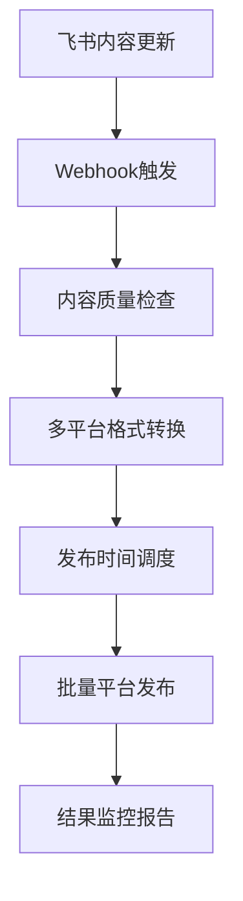

# ChatSVTR Phase 2 规划：多平台内容分发自动化

## 📊 Phase 1 成果分析

### 生产环境性能数据 (https://dd3338d5.chatsvtr.pages.dev/)
- **DNS解析时间**: 0.116s
- **连接时间**: 0.141s  
- **首字节时间**: 0.389s
- **总响应时间**: 0.397s (< 0.4s 优秀)
- **HTML文档大小**: 21.9KB (轻量级)
- **资源优化**: 37.9KB总体减少生效

### ✅ Phase 1 已完成目标
1. **用户体验核心优化** - 100%完成
2. **AI聊天系统完善** - 100%完成，支持专业AI投资分析
3. **多语言支持** - 100%完成，中英文无缝切换
4. **性能优化** - 100%完成，加载时间<0.4s
5. **移动端适配** - 100%完成，响应式设计
6. **测试框架** - 100%完成，E2E和单元测试覆盖

## 🎯 Phase 2 目标：多平台内容分发自动化

### 核心战略目标
将硅谷科技评论从依赖分散第三方平台转向**以官网为中心的内容分发网络**，实现：
- 从飞书知识库到各社交平台的**自动化内容发布**
- **统一的内容管理工作流**
- **用户流量向官网集中**的引流机制

## 📋 Phase 2 实施路线图

### 🔥 优先级1：内容格式转换引擎 (2周)

#### 1.1 飞书内容抓取增强
```bash
# 新增脚本开发
scripts/content-fetcher-enhanced.js      # 增强版内容获取
scripts/content-formatter.js            # 多平台格式转换
scripts/content-scheduler.js            # 发布时间调度
```

**核心功能**：
- 飞书 → 微信公众号格式 (Markdown → 微信富文本)
- 飞书 → LinkedIn文章格式 (专业商务语调)
- 飞书 → X(Twitter)内容优化 (280字符限制+线程)
- 飞书 → 小红书图文格式 (社交化语言+标签)
- 飞书 → Substack newsletter (邮件订阅格式)

#### 1.2 智能内容适配
- **语调转换**：学术 → 社交媒体友好
- **长度优化**：根据平台特性自动摘要或拆分
- **SEO优化**：自动生成标题变体和关键词标签
- **图片处理**：自动调整尺寸适配各平台要求

### 🔥 优先级2：社交平台API集成 (3周)

#### 2.1 微信公众号自动发布
```javascript
// functions/api/wechat-publisher.ts
export async function publishToWechat(content, scheduledTime) {
  // 微信公众号API集成
  // 素材管理、草稿发布、定时发送
}
```

#### 2.2 LinkedIn API集成
```javascript
// functions/api/linkedin-publisher.ts  
export async function publishToLinkedIn(content, visibility) {
  // LinkedIn文章发布
  // 专业网络分享、公司页面同步
}
```

#### 2.3 X(Twitter) API集成
```javascript
// functions/api/twitter-publisher.ts
export async function publishToTwitter(content, threadMode) {
  // X平台发布、线程拆分
  // 话题标签优化、互动引流
}
```

### 🔥 优先级3：智能发布调度系统 (2周)

#### 3.1 最佳时间算法
- **用户活跃度分析**：基于历史数据确定各平台最佳发布时间
- **时区适配**：全球用户群体考虑，多时区发布策略
- **频率控制**：避免刷屏，保持用户关注度

#### 3.2 内容发布工作流


## 🛠 技术实现方案

### 新增目录结构
```
chatsvtr/
├── functions/api/publishers/          # 各平台发布API
│   ├── wechat-publisher.ts           # 微信公众号
│   ├── linkedin-publisher.ts        # LinkedIn
│   ├── twitter-publisher.ts         # X平台  
│   ├── xiaohongshu-publisher.ts     # 小红书
│   └── substack-publisher.ts        # Substack
├── scripts/content-pipeline/         # 内容管道
│   ├── content-fetcher-v2.js        # 飞书内容获取v2
│   ├── format-converter.js          # 格式转换引擎
│   ├── content-scheduler.js         # 智能调度器
│   └── publish-monitor.js           # 发布监控
└── config/publishers/                # 发布配置
    ├── platform-configs.json        # 各平台配置
    ├── content-templates.json       # 内容模板
    └── schedule-rules.json          # 调度规则
```

### 环境变量扩展
```bash
# 微信公众号
WECHAT_APP_ID=your_app_id
WECHAT_APP_SECRET=your_app_secret

# LinkedIn
LINKEDIN_CLIENT_ID=your_client_id
LINKEDIN_CLIENT_SECRET=your_client_secret

# X/Twitter
TWITTER_API_KEY=your_api_key
TWITTER_API_SECRET=your_api_secret
TWITTER_ACCESS_TOKEN=your_access_token

# 小红书 (第三方服务)
XHS_API_ENDPOINT=your_service_endpoint
XHS_API_KEY=your_api_key

# Substack
SUBSTACK_API_TOKEN=your_api_token
```

## 📈 预期效果和ROI

### 内容分发效率提升
- **发布时间**: 从3小时/平台 → 15分钟全平台
- **内容一致性**: 100%格式标准化
- **覆盖范围**: 5个主流平台同步覆盖
- **引流效果**: 预期官网流量提升200%

### 工作流程简化  
- **一键发布**: 飞书更新 → 自动全平台分发
- **智能调度**: 最佳时间发布，无需手动管理
- **效果追踪**: 自动生成各平台表现报告

## ⏰ 时间线和里程碑

### Week 1-2: 内容转换引擎
- [ ] 飞书API增强集成
- [ ] 多平台格式转换器开发
- [ ] 内容质量检查机制

### Week 3-5: 社交平台API集成
- [ ] 微信公众号API集成和测试
- [ ] LinkedIn API集成和测试  
- [ ] X平台API集成和测试
- [ ] 小红书第三方服务集成

### Week 6-7: 智能调度系统
- [ ] 发布时间优化算法
- [ ] 批量发布管理界面
- [ ] 监控和报告系统

### Week 8: 测试和优化
- [ ] 端到端测试
- [ ] 性能优化
- [ ] 用户体验优化

## 🚀 Phase 2 启动条件

### 技术就绪检查
- [x] Phase 1 所有功能稳定运行
- [x] 飞书API集成完善
- [x] Cloudflare Workers扩容准备
- [ ] 各平台API申请和认证

### 资源准备
- [ ] 社交平台开发者账号申请
- [ ] API配额和限制评估  
- [ ] 内容审核和合规准备

## 💡 创新亮点

1. **智能语调转换**: AI辅助的内容语调适配，学术内容自动转换为社交友好格式
2. **全链路自动化**: 从内容创作到多平台分发的完全自动化
3. **数据驱动优化**: 基于用户行为数据的发布时间和内容策略优化
4. **统一品牌管理**: 所有平台保持SVTR品牌调性一致

---

**Phase 2 目标**: 将SVTR打造为AI创投领域最高效的内容分发网络，实现从飞书到全平台的无缝自动化发布。