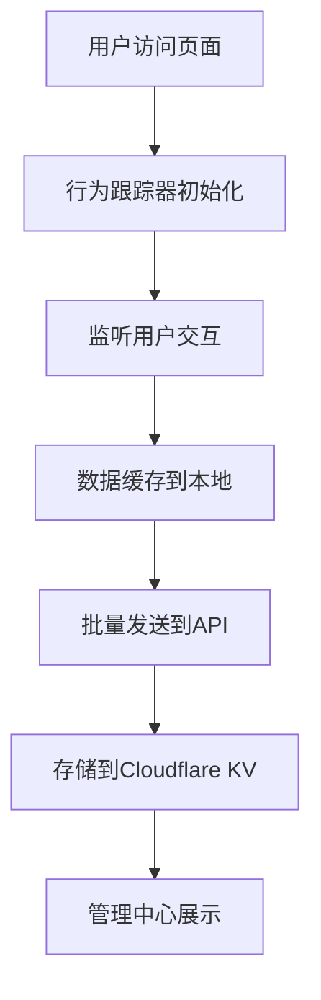

# SVTR用户行为跟踪系统使用指南

## 📊 系统概述

SVTR用户行为跟踪系统是一套完整的用户行为分析解决方案，能够监测网站访问者的页面访问时长、点击行为、表单交互、滚动深度等详细数据，为网站优化和用户体验改进提供数据支撑。

### 核心功能特性

✅ **页面访问监测**
- 页面访问时长统计
- 用户活跃时间计算
- 页面跳转路径分析
- 实时在线用户统计

✅ **用户交互跟踪**
- 点击事件记录和热力图
- 滚动深度里程碑追踪
- 表单填写和提交行为
- 链接点击分析

✅ **会话级分析**
- 完整用户会话记录
- 会话持续时间统计
- 用户参与度评估
- 跨页面行为路径

✅ **管理中心可视化**
- 实时活动监控
- 用户会话详情查看
- 页面性能分析
- 点击热力图展示
- 数据导出功能

## 🚀 快速开始

### 1. 系统部署

系统已完全集成到SVTR网站中，部署只需确保以下组件正常加载：

```html
<!-- 在index.html中已自动包含 -->
<script src="assets/js/user-behavior-tracker.js" defer></script>
```

### 2. Cloudflare配置

确保`wrangler.toml`中配置了KV命名空间：

```toml
[[kv_namespaces]]
binding = "USER_BEHAVIOR_KV"
id = "user-behavior-data-kv-production"
```

### 3. 验证安装

运行测试脚本验证功能：

```bash
node scripts/testing/test-user-behavior-tracking.js
```

## 📈 管理中心使用

### 访问操作日志

1. 登录管理中心 (`/pages/admin-center.html`)
2. 点击左侧导航"操作日志"
3. 系统会自动加载用户行为数据

### 四个核心标签页

#### 🔴 实时活动
- **功能**: 监控当前在线用户的实时行为
- **更新频率**: 每10秒自动刷新
- **数据内容**: 
  - 页面访问事件
  - 点击和交互操作
  - 用户ID和页面路径
  - 操作时间戳

#### 👥 用户会话
- **功能**: 查看用户完整会话信息
- **数据内容**:
  - 会话持续时长
  - 访问页面数量
  - 点击操作统计
  - 用户参与度评分
- **操作**: 点击"查看详情"获取会话路径

#### 📄 页面分析
- **功能**: 分析各页面访问情况
- **核心指标**:
  - 页面浏览量和独立访客
  - 平均停留时间
  - 跳出率分析
  - 转化率统计

#### 🔥 热力图
- **功能**: 可视化用户点击行为
- **使用方法**:
  1. 选择要分析的页面
  2. 查看热点分布图
  3. 点击热点查看详细数据
- **数据**: 点击强度、热点区域数量、最高点击位置

### 过滤和搜索功能

**用户类型过滤**:
- 全部用户
- 注册会员
- 匿名用户

**行为类型过滤**:
- 页面访问
- 点击事件
- 表单提交
- 滚动行为
- 链接点击

**时间范围筛选**:
- 今天
- 昨天
- 本周
- 本月
- 自定义时间范围

## 🔧 技术实现

### 数据收集流程



### 核心数据结构

**基础行为数据**:
```typescript
interface BehaviorData {
  type: string;          // 行为类型
  sessionId: string;     // 会话ID
  userId: string;        // 用户ID
  timestamp: number;     // 时间戳
  page: {
    url: string;         // 页面URL
    path: string;        // 页面路径
    title: string;       // 页面标题
  };
  // ... 其他特定数据
}
```

**会话摘要**:
```typescript
interface SessionSummary {
  sessionId: string;
  userId: string;
  startTime: number;
  endTime?: number;
  totalDuration?: number;
  activeDuration?: number;
  pageViews: number;
  clicks: number;
  maxScrollDepth: number;
  engagement: {
    formSubmissions: number;
    linkClicks: number;
    scrollMilestones: number;
  };
}
```

### API端点

**POST /api/user-behavior**
- 接收用户行为数据批次
- 自动验证和处理数据
- 存储到KV并生成统计

**GET /api/user-behavior**
- 查询参数:
  - `type`: session/page_stats/user_activity
  - `userId`: 用户ID
  - `date`: 日期 (YYYY-MM-DD)
  - `sessionId`: 会话ID

### 存储策略

**数据分层存储**:
- **原始数据**: `raw:{date}:{hour}:{sessionId}:{timestamp}` (30天过期)
- **会话摘要**: `session:{userId}:{sessionId}` (90天过期)
- **页面统计**: `page_stats:{date}:{path}` (365天过期)
- **用户活动**: `user_activity:{date}:{userId}` (90天过期)

## 📊 数据分析建议

### 关键指标解读

**用户参与度评分**:
- 90%+: 极高参与 (深度阅读用户)
- 70-89%: 高参与 (感兴趣用户)  
- 40-69%: 中等参与 (普通浏览)
- 40%以下: 低参与 (快速离开)

**页面跳出率**:
- 25%以下: 优秀 (内容高度相关)
- 26-40%: 良好 (内容适中相关)
- 41-60%: 一般 (需优化内容)
- 60%以上: 较差 (内容或体验问题)

**平均停留时间**:
- 5分钟以上: 深度内容页面表现优秀
- 2-5分钟: 正常的内容消费时间
- 1-2分钟: 快速浏览，可能需要优化
- 1分钟以下: 内容匹配度较低

### 优化建议

**基于热力图优化**:
1. 高点击区域 → 放置重要Call-to-Action
2. 冷点区域 → 重新设计或移除无效元素
3. 意外热点 → 分析用户行为偏好

**基于会话路径优化**:
1. 高跳出页面 → 优化内容质量和相关性
2. 转化漏斗 → 识别用户流失关键节点
3. 深度阅读页面 → 复制成功模式到其他页面

## 🔒 隐私与安全

### 数据保护措施

**用户隐私保护**:
- 所有敏感个人信息都经过匿名化处理
- 邮箱地址只记录域名部分，不记录完整地址
- IP地址不进行记录
- 自动数据过期删除机制

**数据安全**:
- HTTPS传输加密
- Cloudflare KV存储加密
- CORS跨域安全配置
- 错误日志不包含敏感信息

### 合规性

- 符合GDPR数据保护要求
- 实施数据最小化原则
- 提供数据删除机制
- 透明的数据使用政策

## 🚀 进阶使用

### 自定义跟踪事件

可以通过全局变量`svtrBehaviorTracker`添加自定义跟踪：

```javascript
// 跟踪自定义事件
if (window.svtrBehaviorTracker) {
  window.svtrBehaviorTracker.addToBehaviorCache({
    type: 'custom_event',
    sessionId: window.svtrBehaviorTracker.sessionId,
    userId: window.svtrBehaviorTracker.userId,
    timestamp: Date.now(),
    customData: {
      eventName: 'newsletter_signup',
      eventValue: 'premium_subscription'
    }
  });
}
```

### 获取实时统计

```javascript
// 获取当前会话统计
const sessionStats = window.svtrBehaviorTracker.getSessionStats();
console.log('会话统计:', sessionStats);

// 获取热力图数据
const heatmapData = window.svtrBehaviorTracker.getClickHeatmapData();
console.log('点击热力图:', heatmapData);
```

## 📞 技术支持

如需技术支持或功能定制，请联系SVTR技术团队：

- **测试脚本**: `scripts/testing/test-user-behavior-tracking.js`
- **技术文档**: 本文档
- **代码仓库**: `/assets/js/user-behavior-tracker.js`
- **API文档**: `/functions/api/user-behavior.ts`

---

**最后更新**: 2025年09月07日  
**版本**: v1.0.0  
**状态**: 生产就绪 ✅